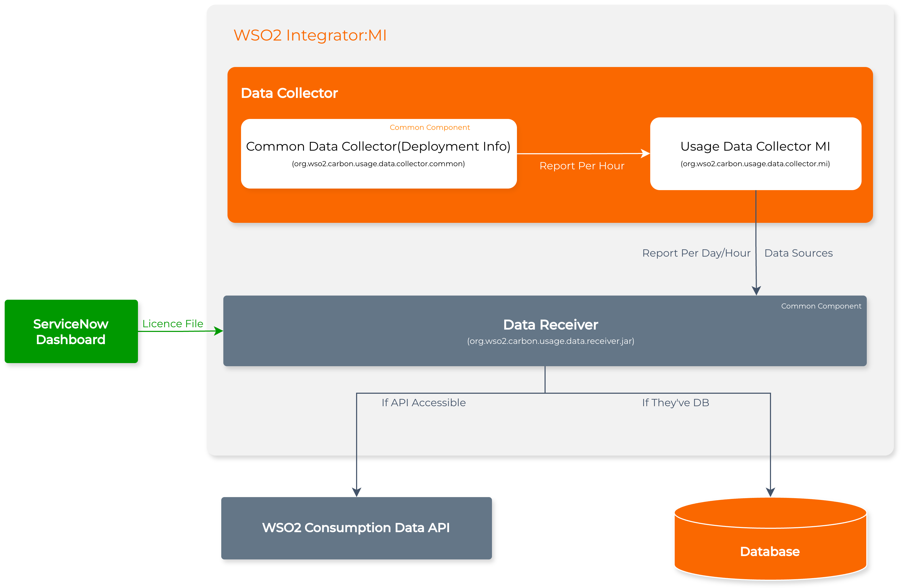

# WSO2 Usage Data Collector for Micro Integrator (MI)

This directory contains the **WSO2 Usage Data Collector** - a component of the Consumption Tracker system designed to effectively track and record product consumption data within the **WSO2 Micro Integrator (MI)** environment.

### Description

During the initial sale of a product (or multiple products), agreements are made regarding the number of cores or transaction volumes. However, after deployment, there is currently no proper visibility into whether customers are consuming more than their allocated limits.

Without an existing mechanism to **record or track consumption** (cores, transaction volumes, or automation runtime), we rely solely on customer-provided information.

The **Usage Data Collector** addresses this challenge by providing a **system to record product consumption data** and **generate usage reports** when required.


---

### Architecture

The consumption tracking system consists of three main components deployed across MI nodes:



## MI-Side Components

The system introduces three main components on the MI side:

- **Common Data Collector** - Gathers environment-level data
- **Usage Data Collector** - Gathers usage and deployment information and sends to Data Receiver
- **Data Receiver** - Receives and secures data before forwarding to endpoints


### Data Collectors

The **Usage Data Collector** is the component housed in this repository. 

The broader Consumption Tracker system includes two types of data collectors:

| Subcomponent | Description | Frequency / Trigger | Location |
|--------------|-------------|---------------------|--------|
| **Common Data Collector** | Collects environment-level data such as CPU core count, JDK version, OS, and update level. | Daily / On restart | collectors/org.wso2.carbon.usage.data.collector.common |
| **Usage Data Collector** | Captures the number of transactions per hour processed by MI nodes. Give the publishing DB info to the Data Receiver. Publish usage-data, deployment info to the Data Receiver.  | Hourly / Event Based | org.wso2.carbon.usage.data.collector.mi |

> **Note**: The **Usage Data Collector** component will be product specific and The Common Data Collector is a component designed for reuse across multiple WSO2 products.


### Data Access Options

- **Local Storage**: If data is stored locally, it can be exported using CLI commands when needed.
- **Public API**: If data is published to the public API, WSO2 can directly monitor customer usage


### Data Receiver
The **Data Receiver** component:

- Secures incoming data from MI nodes
- Forwards data to designated endpoints for processing and storage
- Publishes data based on the available destination:
  - **Choreo-hosted WSO2 API** (for cloud-based monitoring) [Priority]
  - **Internal Database** (for customers preferring on-premise storage)

## Building from Source

### Prerequisites

- Java 8 or higher
- Maven 3.6+
- Git

### Build Steps

```bash
# Clone the repository
git clone https://github.com/wso2/usage-data-collector.git
cd usage-data-collector/collectors/org.wso2.carbon.usage.data.collector.mi

# Build the project
mvn clean install

# The JAR will be created at:
# counter/target/org.wso2.carbon.usage.data.collector.mi-0.1.0.jar
```

---

## Project Structure

```
usage-data-collector/
├── collectors/
│   └── org.wso2.carbon.usage.data.collector.mi/
│       src
│       └── main
│           └── java
│               └── org
│                   ├── apache
│                   │   ├── axis2
│                   │   │   └── context
│                   │   │       └── MessageContext.java         # Axis2 message context representation
│                   │   └── synapse
│                   │       ├── AbstractExtendedSynapseHandler.java   # Base handler for Synapse extensions
│                   │       ├── core
│                   │       │   └── axis2
│                   │       │       └── Axis2MessageContext.java      # Synapse wrapper for Axis2 message context
│                   │       └── MessageContext.java                   # Synapse message context abstraction
│                   └── wso2
│                       └── carbon
│                           └── usage
│                               └── data
│                                   └── collector
│                                       └── mi
│                                           ├── datasource
│                                           │   └── DataSourceProvider.java         # Provides DB connections for publishing
│                                           ├── publisher
│                                           │   └── PublisherImpl.java              # Implements data publishing logic
│                                           └── transaction
│                                               ├── aggregator
│                                               │   └── TransactionAggregator.java  # Aggregates transaction data hourly
│                                               ├── counter
│                                               │   ├── TransactionCounterConstants.java   # Constants for transaction counting
│                                               │   ├── TransactionCountHandler.java       # Handles transaction count events
│                                               │   └── TransactionCountingLogic.java      # Core logic for counting transactions
│                                               ├── publisher
│                                               │   ├── TransactionPublisher.java          # Interface for publishing transactions
│                                               │   └── TransactionPublisherImpl.java      # Implementation for publishing transactions
│                                               └── record
│                                                   └── TransactionReport.java             # Model for transaction report data
```

---

## Data Collected

### Usage Data (Hourly)

- Transaction count per hour

---

## Contributing

We welcome contributions from the community! To contribute:

1. Fork the repository
2. Create a feature branch (`git checkout -b feature/amazing-feature`)
3. Commit your changes (`git commit -m 'Add amazing feature'`)
4. Push to the branch (`git push origin feature/amazing-feature`)
5. Open a Pull Request

### Guidelines

- Follow existing code style and conventions
- Update documentation as needed
- Ensure compatibility with Apache 2.0 License

---

## Issues and Support

Please report issues at: [GitHub Issues](https://github.com/wso2/product-micro-integrator/issues)

For WSO2 product support, visit:
- [WSO2 Support Portal](https://support.wso2.com/)
- [WSO2 Community](https://wso2.com/community/)

---

## License

This project is licensed under the [Apache 2.0 License](http://www.apache.org/licenses/LICENSE-2.0).

---

## Additional Resources

- [WSO2 Micro Integrator Documentation](https://mi.docs.wso2.com/)
- [WSO2 API Manager Documentation](https://apim.docs.wso2.com/)
- [Apache Synapse](https://synapse.apache.org/)

---

(c) 2025, [WSO2 LLC](http://www.wso2.org/). All Rights Reserved.